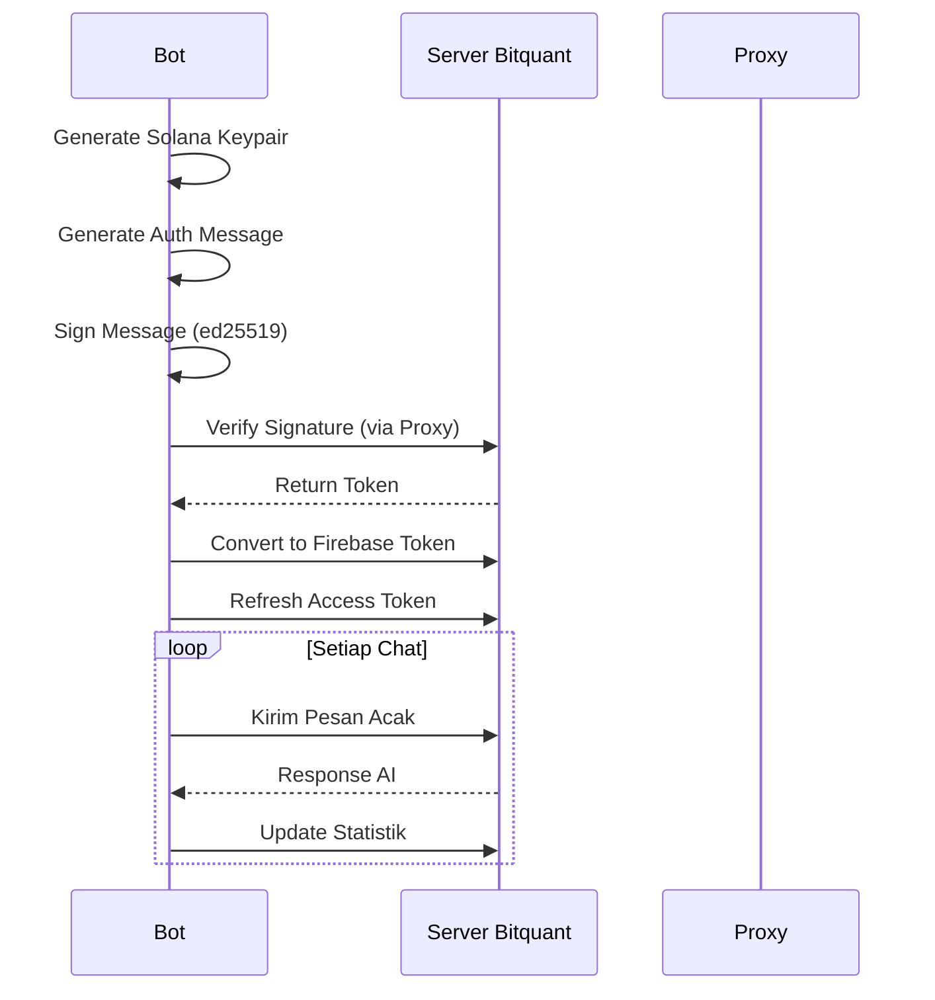

# 🔥 BITQUANT SOLANA BOT 🔥
Automated Solana Chat Bot with Multi-Account & Proxy Support  

> Bot otomatis untuk klaim harian BITQUANT dengan dukungan multi-akun Solana, manajemen proxy cerdas, dan sistem retry canggih.

## ✨ Fitur Utama
- **Multi-Account Support** - Jalankan ratusan akun sekaligus dari file `pk.txt`
- **Proxy Management** - Rotasi proxy otomatis dengan deteksi proxy mati
- **Daily Automation** - Jadwal eksekusi harian otomatis (setiap 24 jam)
- **Anti-Detect** - Random User-Agent & perilaku manusia
- **Respons Cerdas** - Simpan riwayat percakapan untuk interaksi natural
- **Statistik Real-time** - Lacak poin, chat harian, dan total chat
- **UI Keren** - Gradient, animasi teks, dan progress bar
- **Error Handling** - Retry otomatis untuk 403/error jaringan
- **Solana Security** - Sign message dengan algoritma Ed25519

## 📦 Prasyarat
- Node.js v18+
- Akun Solana (dengan saldo gas)
- File teks berisi private keys (`pk.txt`)
- File teks berisi pesan (`pesan.txt`)
- Proxy list (`proxy.txt` - opsional)

## ⚙️ Instalasi
1. Clone repository ini:
```bash git clone https://github.com/dicoderin/bitbot.git```
```cd bitbot```

2. Install dependencies:
```bash npm install```

3. Siapkan file konfigurasi:
- `pk.txt` - Satu private key per baris (format base58)
- `pesan.txt` - Satu pesan per baris untuk dikirim ke bot
- `proxy.txt` - Satu proxy per baris (format: `http://user:pass@ip:port`)

## 🚀 Penggunaan
Jalankan bot dengan:
```bash node index.js```

### Opsi Tambahan:
bash
# Mode non-interaktif (untuk cronjobs)
node index.js --non-interactive

# Non-animasi teks (performansi lebih tinggi)
node index.js --no-type

## 🧠 Logika Bot


## 📁 Struktur File
```
bitquant-solana-bot/
├── index.js                 # Main script
├── pk.txt                 # Private keys Solana
├── pesan.txt              # Daftar pesan acak
├── proxy.txt              # Daftar proxy (opsional)
├── package.json
└── README.md
```

## ⚠️ Catatan Keamanan
1. Private key **TIDAK PERNAH** dikirim ke server manapun
2. Signature dibuat secara lokal menggunakan `tweetnacl`
3. Selalu gunakan proxy untuk akun besar
4. Bot menggunakan domain resmi Bitquant (`quant-api.opengradient.ai`)

## 📈 Contoh Output


## 🔄 Daily Auto-Run
Bot otomatis akan berjalan setiap 24 jam setelah eksekusi pertama. Sistem countdown akan muncul setelah proses selesai:
```
WAITING FOR NEXT RUN...
Next run in: 23:59:42
```

## 📝 Kontribusi
1. Fork project
2. Buat branch baru (`feat/your-feature`)
3. Commit perubahan
4. Push ke branch
5. Buat Pull Request

## 📜 Lisensi
Proyek ini dilisensikan di bawah [MIT License](LICENSE)

---
**Disclaimer**: Gunakan dengan tanggung jawab. Developer tidak bertanggung jawab atas akun yang terkena suspensi.

**Telegram Support**: [@allowindo](https://t.me/allowindo)  
**Version**: 2.0 Solana Edition  
**Daily Limit**: 20 chats/account  
**Update Terakhir**: 8 Juni 2025
